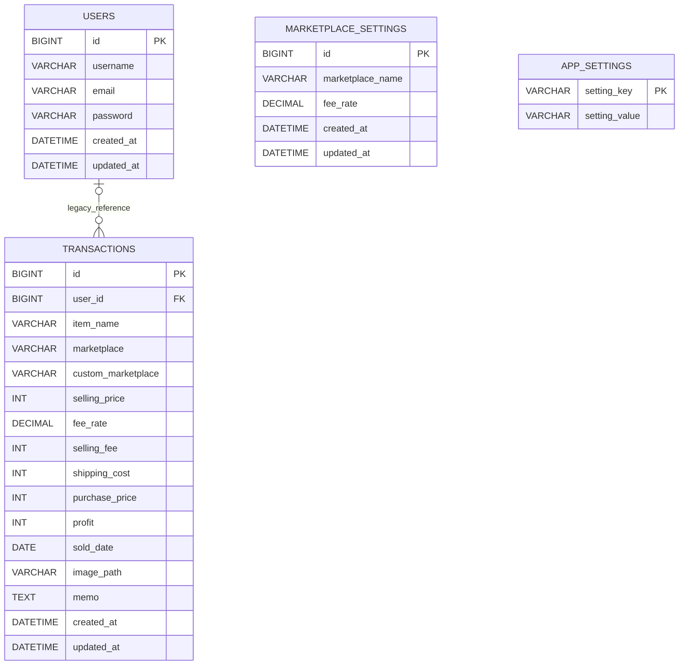

# ER設計

## リレーション
- USERSとTRANSACTIONS.user_idは既存DB互換用。ユーザー情報管理には使用しない。
- 取引からユーザーへの参照は任意（0または1）。新規登録ではuser_idをNULLとする。
- marketplace_settings は手数料率参照用
- app_settingsは端数処理と月間利益目標を保存する。
- ログイン・所有者確認・ユーザー別データ分離は行わない。
