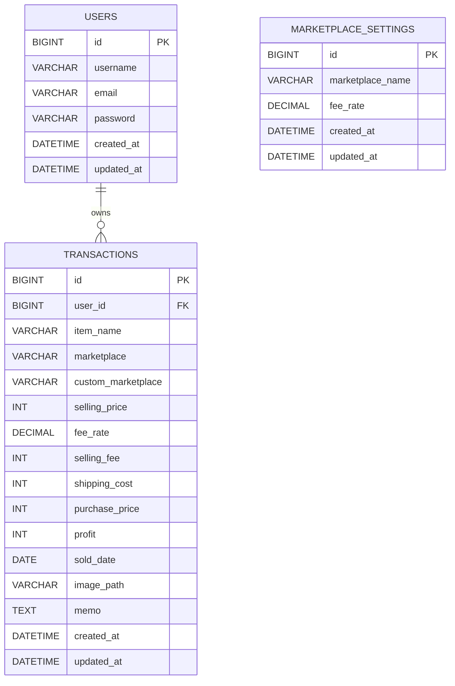

# ER設計

```mermaid
erDiagram
    USERS ||--o{ TRANSACTIONS : owns

    USERS {
        BIGINT id PK
        VARCHAR username
        VARCHAR email
        VARCHAR password
        DATETIME created_at
        DATETIME updated_at
    }

    TRANSACTIONS {
        BIGINT id PK
        BIGINT user_id FK
        VARCHAR item_name
        VARCHAR marketplace
        VARCHAR custom_marketplace
        INT selling_price
        DECIMAL fee_rate
        INT selling_fee
        INT shipping_cost
        INT purchase_price
        INT profit
        DATE sold_date
        VARCHAR image_path
        TEXT memo
        DATETIME created_at
        DATETIME updated_at
    }

    MARKETPLACE_SETTINGS {
        BIGINT id PK
        VARCHAR marketplace_name
        DECIMAL fee_rate
        DATETIME created_at
        DATETIME updated_at
    }
```

## リレーション
- 1ユーザーは複数取引を持つ
- 各取引は必ず1ユーザーに属する
- marketplace_settings は手数料率参照用
