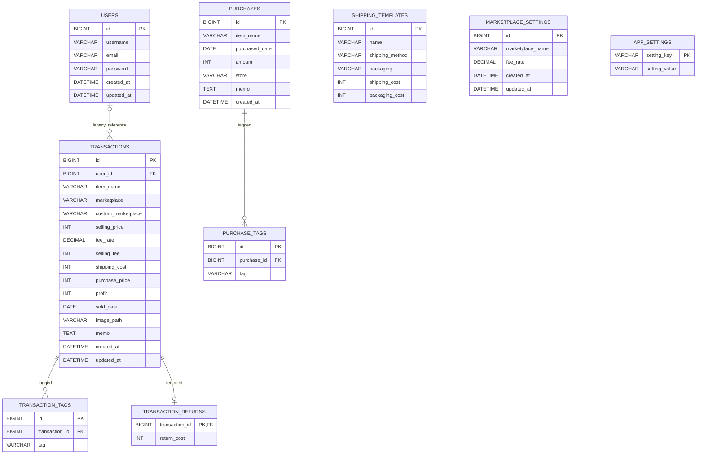

# ER設計

2026-10-06更新。送料・梱包テンプレートは独立した`shipping_templates`テーブルに保存する。取引とのリレーションは持たず、選択時の合計費用だけを`transactions.shipping_cost`へコピーする。テンプレートの変更・削除は保存済み取引に影響しない。

MySQLの個人利用とH2のdemo構成で共通の論理構造を使用する。リポジトリに記録された公開状況は、公開用構成の準備までで、実デプロイ・公開URL発行は未完了。demoでは同じデータを全閲覧者が操作し、ユーザーごとの分離は行わない。初期データ・保存期間は02_database_design.mdを参照。

画像の実体はER図の管理対象外のファイル領域にあり、transactions.image_pathだけをDBへ保存する。demoのDB初期化は画像の一括削除と連動しない。

## リレーション
- TRANSACTIONSの1件に対してTRANSACTION_RETURNSは0または1件。返品費用0円でも行があれば返品。取引削除時は返品・タグを連動削除する。
- SHIPPING_TEMPLATESは独立した設定。取引にテンプレートIDや配送方法・梱包内容を保存しない。
- 前月比較・販売カレンダー・値下げシミュレーションの専用エンティティは設けない。前二者は取引から算出し、試算結果は保存しない。
- USERSとTRANSACTIONS.user_idは既存DB互換用。ユーザー情報管理には使用しない。
- 取引からユーザーへの参照は任意（0または1）。新規登録ではuser_idをNULLとする。
- marketplace_settings は手数料率参照用
- app_settingsは端数処理と月間利益目標を保存する。
- purchasesはホーム画面の購入履歴を保存する独立したテーブル。transactionsとの関連・自動反映は行わない。
- ログイン・所有者確認・ユーザー別データ分離は行わない。
