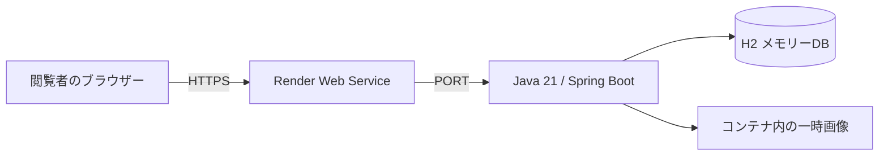

# 公開・運用手順

2026-10-05時点。公開用コードはGitHubのmain（69cb17d）へ反映済み。Renderアカウントへの接続と実デプロイは未完了で、公開URLは未発行。

## 構成

以下は準備済みの公開用構成であり、稼働中の公開環境を示すものではない。

`Dockerfile` はMavenでテストとJARの作成を行い、Java 21 JREの非rootユーザーで起動する。個人のDB・画像・環境変数ファイル・Git履歴をイメージへコピーしない。JVMのヒープ上限はコンテナメモリーの60%、タイムゾーンはAsia/Tokyo。

`render.yaml` はシンガポールのFree Web Serviceを1つ定義する。`demo`プロファイル、`0.0.0.0`への待受、Renderの`PORT`への追従、`/healthz`によるDB疎通確認を使用する。DBの内容は全閲覧者で共有し、プロセス再起動で再初期化する。画像領域はRenderの再デプロイ・再起動・休止で失われる。自動で常時リセットする機能や利用者ごとの隔離はない。

アプリ自身は起動時に画像を一括削除しない。同じDockerコンテナの再起動では画像が残るため、DB初期化後に未参照ファイルや既知URLから取得可能な画像が残る場合がある。Renderの一時領域破棄とアプリの初期化処理は別である。現行Composeには画像用ボリュームがなく、downによるコンテナ削除と再作成で画像も破棄される。

ホームの初回設定案内は常に表示されるが、demoは仮設定を投入済みのため設定操作なしで利用できる。

## 公開手順

1. ローカルで `.\mvnw.cmd -B -ntp verify` とDockerビルドを確認する。
2. 変更をGitHubへpushし、RenderでそのブランチからBlueprintを作成する。既存サービスの名前と衝突する場合は新しい名前を指定する。
3. `runtime: docker`、`plan: free`、`SPRING_PROFILES_ACTIVE=demo`、health check `/healthz` を確認する。個人利用のMySQL接続情報は設定しない。
4. デプロイログでビルド成功・アプリ起動・Liveを確認し、発行された実URLで下記の受入確認を行う。
5. READMEの公開URLとこの文書の公開状況を更新する。

GitHub連携・Renderでのサービス作成が必要なため、リポジトリ内の設定ファイルを追加しただけでは公開完了にはならない。

## 公開後の受入確認

- シークレットウィンドウからHTTPS URLを開き、インストールやログインなしで公開デモ案内と購入サンプルが見える。
- ダッシュボードに今月の売却サンプルとグラフが表示される。
- 設定作業なしで架空の取引を登録でき、編集・削除ができる。
- タグ・期間検索の結果とCSVの内容が一致する。
- 架空の購入履歴の登録とタグ変更、画像アップロード／置換／削除ができる。
- `/healthz` がHTTP 200を返す。DB不通時は503を返し、接続情報を公開しない。
- サービス再起動後、ヘルスチェック成功を待ってDBが初期サンプルへ戻ることを確認する。画像の消失はDB初期化の判定に含めず、保存領域の寿命に従う。無料プラン休止後のアクセスでは起動待ちになることを確認する。

## 環境設定

| 設定 | 用途 |
| --- | --- |
| `SPRING_PROFILES_ACTIVE=demo` | 一時的な公開デモ。未指定は個人利用のMySQL構成 |
| `PORT` | HTTPポート。未指定8080、Renderではプラットフォームの指定値 |
| `SERVER_ADDRESS` | 待受アドレス。通常127.0.0.1、Dockerとdemoは0.0.0.0 |
| `server.forward-headers-strategy` | demoではnative。TomcatがRenderのHTTPS転送ヘッダーを解釈し、リダイレクトとSecure Cookieへ反映 |
| `SPRING_DATASOURCE_URL/USERNAME/PASSWORD` | 個人利用MySQLの接続先を変更するときに使用。demoには指定しない |
| `APP_PHOTOS_DIRECTORY` | 画像保存先。初期値 `./uploads/images` |
| `JAVA_TOOL_OPTIONS` | DockerのJVMメモリー上限・タイムゾーン設定 |

## 制約と障害時の確認

Freeは一定時間の無通信で休止するため、常時即時応答を保証しない。デモは実データの保管先ではない。永続的な公開サービスに移行する場合は、認証・データ分離・永続DB・画像ストレージ・バックアップ・負荷対策を別途設計する。

起動失敗時はビルドログ、Java 21、`demo`の有効化、`PORT`と待受を確認する。登録不能時は設定画面の料率・端数処理を確認する（他の閲覧者も変更可能）。メモリー不足やデータの蓄積で動作が不安定な場合はサービスを再起動し、必要に応じてプランを見直す。ローカルのデモを完全に作り直すには `docker compose -f compose.demo.yaml down` 後に再度 `up -d` を実行する。

参考：[Render Docker](https://render.com/docs/docker)、[Blueprint仕様](https://render.com/docs/blueprint-spec)、[待受ポート](https://render.com/docs/web-services#port-binding)、[無料プランと一時ファイル](https://render.com/docs/free)。
